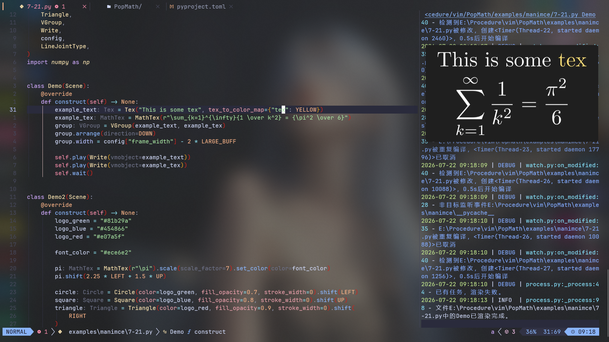

# ManimPreview

An automated tool to preview Manim animations via a web browser.

Tools with similar goals already exist, but those I have tried come with noticeable drawbacks. Some are tightly coupled with VSCode (while I use Neovim), and many lack comprehensive configuration documentation.

After struggling with existing solutions, I decided to build my own tool, and ManimPreview was born.

## Usage

### Installation

- uv : `uv add manim-preview`
- pip : `pip install manim-preview`

### CLI Usage

This tool provides the `manim-preview` CLI command. Run the following in your terminal:

```bash
manim-preview [src_path] [scene_name]
```

- `src_path`: Path to the source file to monitor
- `scene_name`: Name of the scene class to render. Only one scene is supported at present.

After startup:

1. The tool begins monitoring the target source file (`src_path`).
2. It automatically opens your default web browser.
3. A temporary video file `static/tmp.mp4` will be generated under the working directory for browser playback.

Each time you save changes to the source file, automatic rendering will trigger, updating `tmp.mp4` and refreshing the preview in the browser.

Browsers supporting picture-in-picture mode (such as Microsoft Edge) are highly recommended. This avoids frequent tab switching while developing animations.

Example workflow:


> [!WARNING]
> I am fully aware of my limitations as a developer. This tool remains fragile. Many edge cases, type checks and parameter validation have not been implemented.
> Error messages may be incomplete or unclear. It works for my use cases, and if you encounter issues, restarting the program usually resolves most problems.

## Configuration Options

User configuration is loaded from `mpconfig.toml` located in the directory where you run the `manim-preview` command.

> [!NOTE]
> All configuration values are loaded once on startup. Dynamic reloading of the config file during runtime is **not supported**.

Full available configuration:

```toml
[log]
# Log level for frontend messages printed by the server
# Levels ordered verbosity: critical > error > warning > info > debug > trace
# Lower level = more logs
web_level = "info"

# Log level for console output
# Levels ordered verbosity: CRITICAL > ERROR > WARNING > INFO > DEBUG > TRACE
# Note: This option uses uppercase level names
console_level = "DEBUG"

# Format string for console logs
# Color formatting syntax follows official Loguru documentation
console_formatter = "<level>{level}</level>: <level>{message}</level>"

# Log level for file output
# Level naming rules match console_level
file_level = "INFO"

# Path and naming pattern for log files
# Syntax follows official Loguru documentation
file_sink = "logs/{time:YYYY-MM-DD}.log"

[manim]
# Quality argument passed to Manim render commands
# Quality ranking: -qk > -qp > -qh > -qm > -ql
# Higher quality requires longer rendering time
quality = "-ql"

# Delay (seconds) between file change detection and render start
# Used to suppress duplicate rendering triggered by rapid successive file saves
render_interval = 0.5

[http]
# Port used for the web preview page and backend server.
# Change this value if the default port is occupied.
port = 8000
```

## Integration with Neovim

I use LazyNvim as my Neovim starter distribution. LazyNvim automatically loads all files inside `nvim/lua/plugins/`, so you can directly place custom command definitions there.

For example, create `nvim/lua/plugins/user_commands.lua`:

```lua
-- Run `uv run preview %:p Scene_name` automatically
local function start_preview(_)
  local scene_name = vim.fn.expand("<cword>")
  local curr_path = vim.fn.expand("%:p")

  -- Modify the command if you are not using uv
  -- uv allows running manim-preview without manually activating a Python virtual environment
  local cmd = "uv run manim-preview " .. curr_path .. " " .. scene_name

  -- This example uses toggleterm as the terminal provider
  -- You can replace it with Neovim's built-in terminal (window layout will be less convenient)
  local Terminal = require("toggleterm.terminal").Terminal

  Terminal:new({
    cmd = cmd,
    direction = "vertical",
  }):toggle()
end

-- Register Neovim user command
vim.api.nvim_create_user_command(
  "PreviewManimAnimation",
  start_preview,
  { nargs = 0 }
)

-- LazyNvim requires plugin files to return a config table; return empty table here
return {}
```

> [!WARNING]
> This Lua snippet depends on the third-party Toggleterm plugin, which needs to be installed beforehand.

Save the file and reload Neovim. Place your cursor over the target scene class name, then run:

```vim
:PreviewManimAnimation
```

Neovim will open a vertical terminal window and launch

```bash
uv run manim-preview src_path scene_name
```

You can then iterate and create Manim animations with live web preview.

> [!NOTE]
> The `plugins` directory is intended for plugins rather than custom user commands. My preferred alternative setup:
> Create `nvim/lua/custom/commands.lua`, then load it inside `nvim/init.lua`:
>
> ```lua
> require("custom.commands")
